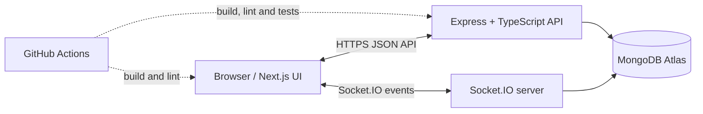

# Collaborative Workspace

A full-stack collaboration app for teams to manage workspaces, documents, tasks, and team conversations in one place. Built with **Next.js, React, TypeScript, Express, MongoDB, and Socket.IO**.

<p align="left">
  <a href="https://collaborative-workspace-sable.vercel.app/">Live application</a> ·
  <a href="https://collaborative-workspace-thlz.onrender.com/api/health">Backend health</a> ·
  <a href="https://github.com/MehtaabSingh25/Collaborative-Workspace">Source code</a>
</p>

[](https://github.com/MehtaabSingh25/Collaborative-Workspace/actions/workflows/ci.yml)

> **Portfolio project:** The live application is hosted on Vercel (frontend) and Render (backend), with MongoDB Atlas for persistence.

## Features

- **Authentication:** account registration and login, password hashing, JWT access/refresh token handling, and protected API routes.
- **Workspaces and invitations:** create workspaces, invite members, and accept invitations.
- **Role-based access control:** `OWNER`, `EDITOR`, and `VIEWER` roles enforced by backend authorization checks.
- **Collaborative documents:** create and edit workspace documents, review revision history, and restore earlier versions with version checks.
- **Task management:** create, assign, prioritize, update status, set due dates, and delete tasks within a workspace.
- **Real-time collaboration:** authenticated Socket.IO connections, document updates, collaborator presence, and workspace chat.
- **Persistent chat history:** store and retrieve workspace messages from MongoDB.
- **Security foundations:** request validation, security headers, CORS configuration, rate limiting, and server-side authorization.
- **Automated checks:** GitHub Actions runs backend build/tests and frontend lint/build checks.

## Live links

| Service | URL |
|---|---|
| Frontend | https://collaborative-workspace-sable.vercel.app/ |
| Backend health endpoint | https://collaborative-workspace-thlz.onrender.com/api/health |
| GitHub repository | https://github.com/MehtaabSingh25/Collaborative-Workspace |

The health endpoint verifies that the API process responds; it is not a full end-to-end check of every feature. Hosting platforms may take a short time to wake a service after inactivity.

## Architecture



- **Frontend:** Next.js App Router, React, TypeScript, and `socket.io-client`.
- **Backend:** Express 5, TypeScript, Mongoose, JWT-based authentication, and Socket.IO.
- **Database:** MongoDB stores users, workspaces, memberships, documents, revisions, tasks, and chat messages.
- **CI:** GitHub Actions validates the backend and frontend on pushes and pull requests targeting `main`.

See [`docs/ARCHITECTURE.md`](docs/ARCHITECTURE.md) for request flows, authorization boundaries, and deployment configuration.

## Tech stack

| Layer | Technologies |
|---|---|
| Frontend | Next.js, React, TypeScript, CSS, Socket.IO client |
| Backend | Node.js, Express 5, TypeScript, Socket.IO |
| Persistence | MongoDB, Mongoose |
| Authentication/security | JWT, bcrypt, cookie-parser, Helmet, CORS, rate limiting, Zod validation |
| Testing | Vitest, Supertest, Socket.IO client, mongodb-memory-server |
| Delivery | GitHub Actions, Docker, Vercel, Render, MongoDB Atlas |

## Run locally

### Prerequisites

- Node.js 22 recommended
- npm
- A local MongoDB instance or MongoDB Atlas database

### 1. Start the backend

```bash
cd backend
npm ci
```

Copy `backend/.env.example` to `backend/.env`. Set `MONGODB_URI`, use distinct random values for both JWT secrets, and set `CLIENT_URL` to the frontend origin (locally, `http://localhost:3000`).

```bash
npm run dev
```

The backend defaults to port `5000`. Check `http://localhost:5000/api/health` for the health response.

### 2. Start the frontend

In a second terminal:

```bash
cd frontend
npm ci
```

Copy `frontend/.env.local.example` to `frontend/.env.local` and set `NEXT_PUBLIC_API_URL=http://localhost:5000`.

```bash
npm run dev
```

Open http://localhost:3000.

## Environment variables

### Backend (`backend/.env`)

| Variable | Purpose |
|---|---|
| `PORT` | HTTP and Socket.IO server port; hosting platforms may supply this automatically. |
| `CLIENT_URL` | Exact frontend origin allowed by CORS and Socket.IO. |
| `MONGODB_URI` | MongoDB connection URI. |
| `JWT_ACCESS_SECRET` | Private signing secret for access tokens. |
| `JWT_REFRESH_SECRET` | Separate private signing secret for refresh tokens. |
| `ACCESS_TOKEN_EXPIRES_IN` | Access-token lifetime, for example `15m`. |
| `REFRESH_TOKEN_EXPIRES_IN` | Refresh-token lifetime, for example `7d`. |

### Frontend (`frontend/.env.local`)

| Variable | Purpose |
|---|---|
| `NEXT_PUBLIC_API_URL` | Backend origin used by browser API requests and the Socket.IO client, without a trailing slash. |

Never commit real environment files or production secrets. `NEXT_PUBLIC_` variables are exposed to browser code and must not contain secrets.

## Quality checks

Run the backend checks:

```bash
cd backend
npm ci
npm run build
npm test
```

Run the frontend checks:

```bash
cd frontend
npm ci
npm run lint
npm run build
```

Backend tests use Vitest. Some tests start an in-memory MongoDB instance, which may download its MongoDB binary on the first run. GitHub Actions runs the same build/test and lint/build checks for pushes and pull requests targeting `main`.

## Deployment

The current deployment uses:

- **Frontend:** Vercel — https://collaborative-workspace-sable.vercel.app/
- **Backend:** Render — https://collaborative-workspace-thlz.onrender.com
- **Database:** MongoDB Atlas

Deployment and Docker guidance is documented in [`DEPLOYMENT.md`](DEPLOYMENT.md). Configure `CLIENT_URL` to the exact Vercel origin and `NEXT_PUBLIC_API_URL` to the backend origin. Store secrets in the hosting provider's environment settings, not in source control.

## Security considerations

- Use long, unique, random JWT secrets and keep them private.
- Keep MongoDB credentials private and restrict database network access to the extent supported by your host.
- Use HTTPS in production and restrict CORS to the expected frontend origin.
- Review dependency audit findings and update dependencies deliberately; avoid `npm audit fix --force` without reviewing breaking changes.
- Re-test authentication/refresh-token behavior, role enforcement, rate limits, logging, and backups whenever deployment configuration changes.

## Repository layout

```text
backend/
  src/modules/       authentication, workspace, documents, tasks, chat
  src/socket/        authenticated Socket.IO handlers and event types
  tests/             API, RBAC, rate-limit, and socket/integration tests
frontend/
  app/               Next.js routes and workspace interface
  src/lib/           Socket.IO client setup
.github/workflows/   continuous integration
 docs/               architecture notes
```

## Resume-ready project summary

**Collaborative Workspace — Full-Stack Collaboration Platform**

- Built a full-stack workspace application using Next.js, React, TypeScript, Express, MongoDB, and Socket.IO with authentication and role-based workspace access.
- Implemented collaborative document revision history, task management, member invitations, and persistent real-time team chat.
- Added backend API/socket tests and GitHub Actions checks, and deployed the frontend and backend using Vercel and Render.

Adapt these bullets to accurately reflect the parts you implemented and can explain in an interview. Do not add performance metrics unless you have measured them.

## License

No license is currently declared. Add a license if you intend to permit reuse or redistribution.
