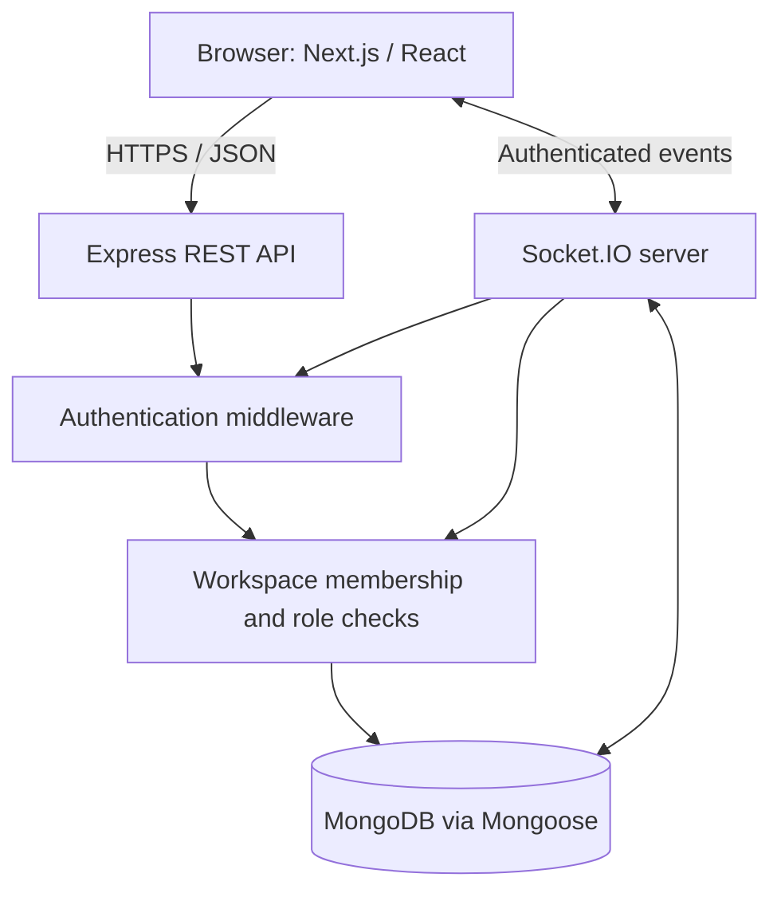

# Architecture Notes

This document summarizes the major components and trust boundaries in Collaborative Workspace.

## Component overview

The frontend calls the REST API for persistent operations and connects to Socket.IO for real-time collaboration. The backend is the authority for authentication and workspace access; client-side UI state must not be treated as an authorization boundary.

## Main domains

- **Authentication:** registration/login and token-based authentication.
- **Workspaces:** workspace ownership, memberships, invitations, and role checks.
- **Documents:** document CRUD, revision history, restoration, and version-aware updates.
- **Tasks:** workspace-scoped tasks with assignees, status, priority, and due dates.
- **Chat:** persisted workspace messages and real-time message delivery.
- **Socket.IO:** authenticated connections, workspace/document rooms, presence, and real-time events.

## Authorization principles

1. Authenticate REST requests and Socket.IO connections.
2. Check active membership on workspace-scoped operations.
3. Enforce the user's role on the server for write operations; hiding a button in the frontend is not sufficient.
4. Validate request payloads and constrain message/document input sizes.
5. Avoid broadcasting workspace events to sockets that are not authorized for that workspace.

## Production configuration

- `CLIENT_URL` must match the deployed frontend origin for CORS and Socket.IO.
- `NEXT_PUBLIC_API_URL` must point to the deployed backend origin and is public browser configuration, not a secret.
- `MONGODB_URI` and JWT secrets belong only in backend/hosting environment settings.
- Keep HTTPS enabled and verify cookie behavior across the frontend/backend domains.

## Useful verification paths

- API health: `GET /api/health`
- Backend tests: `cd backend && npm test`
- Backend TypeScript build: `cd backend && npm run build`
- Frontend lint/build: `cd frontend && npm run lint && npm run build`

This document describes the current repository at a high level. Refer to the source routes, services, and socket handlers for exact payload contracts and implementation details.
